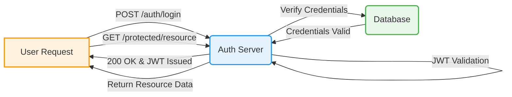

# VivaFit Authentication System

<div align="center">
  
</div>

---

## Overview
The VivaFit Authentication System is a comprehensive solution integrating both frontend and backend components. It handles user registration, login, token issuance, and role-based access control—ensuring that only authenticated users can access protected features while delivering a seamless user experience.

---

## Table of Contents
1. [Features](#features)
2. [System Architecture](#system-architecture)
3. [Installation and Setup](#installation-and-setup)
4. [Configuration](#configuration)
5. [Usage](#usage)
   - [Register a New User](#register-a-new-user)
   - [User Login](#user-login)
   - [Access Protected Endpoint](#access-protected-endpoint)
   - [Refresh Token](#refresh-token)
   - [Password Reset](#password-reset)
6. [Security Considerations](#security-considerations)
7. [API Endpoints](#api-endpoints)
8. [Workflows](#workflows)
9. [Testing](#testing)
10. [Contributing](#contributing)
11. [License](#license)

---

## Features
- **Frontend Integrated UI:** Responsive design with intuitive dashboards and real-time feedback.
- **Backend API Endpoints:** Robust RESTful services for authentication, token management, and user profile operations.
- **User Registration & Verification:** Secure registration using email/password and optional email verification.
- **JWT-Based Authentication:** Stateless session management using JSON Web Tokens.
- **Token Refresh & Logout:** Short-lived access tokens with refresh tokens ensure seamless sessions.
- **Password Recovery:** Secure password reset workflow via email.
- **Role-Based Access Control (RBAC):** Define and enforce permissions based on user roles.
- **Audit Logging & Monitoring:** Detailed activity logs for security audits and performance monitoring.
- **Scalability:** Designed for high-volume authentication requests.
- **Integration-Ready:** RESTful APIs that work with mobile and web clients.

---

## System Architecture
The system is structured as a microservice comprising:

- **Auth Server:** Core service (Node.js/Express) exposing authentication APIs.
- **Database:** Stores user profiles, hashed passwords, and token data (e.g., PostgreSQL, MongoDB).
- **Client Applications:** VivaFit web and mobile clients that interact with the Auth Server.
- **External Services:** Email/SMS services for verification and password reset.

### Authentication Flow Diagram


# Technical Architecture for VivaFit

This document provides an overview of the VivaFit technical architecture following the MVC pattern. It covers both the client and server components along with the database. Each tool used is explained with key advantages.

---

## Overview

VivaFit is built using a modern, scalable architecture where:

- **Models** handle data and business rules.
- **Views** represent the user interface.
- **Controllers** mediate between models and views.

The system is divided into client and server components, connected via RESTful APIs.

---

## Visual Architecture Diagram

```mermaid
graph TD
    subgraph Server_MVC
        Server (MVC)
        A[Express Router] --> B[Controller]
        B --> C[(Model: Mongoose)]
        B --> D[Firebase Admin]
    end

    subgraph Client_React
        Client (React)
        E[React Components] --> F[AuthContext & Custom Hooks]
        F --> G[API Services]
        G -->|HTTP Requests| A
    end

    classDef reactStyle fill:#E1F5FE,stroke:#0288D1,stroke-width:2px;
    classDef serverStyle fill:#FFF3E0,stroke:#FF9800,stroke-width:2px;
    classDef dbStyle fill:#E8F5E9,stroke:#4CAF50,stroke-width:2px;
  
    class A,B,D serverStyle;
    class C dbStyle;
    class E,F,G reactStyle;
```

---

## Tools & Explanation

### Client (Frontend)

- **React & Vite**  
  - **React** (🖥️): JavaScript library for building dynamic UI.  
    - *Advantage:* Component-based, reusability and a vibrant ecosystem.
  - **Vite** (⚡): Fast development server and build tool.
    - *Advantage:* Lightning-fast hot module replacement (HMR) and optimized builds.

- **Tailwind CSS**  
  - Utility-first CSS framework for rapid styling.
    - *Advantage:* Highly customizable and consistent design without leaving your markup.  
  - **React Router Dom** for client-side routing.
    - *Advantage:* Seamless navigation between pages.

- **Axios (optional)**  
  - For making HTTP requests.
    - *Advantage:* Simplifies promise-based HTTP requests with additional features.

### Server (Backend)

- **Node.js & Express**  
  - **Node.js** (⚙️): JavaScript runtime for building scalable backend applications.
    - *Advantage:* Single language (JavaScript) across the entire stack.
  - **Express**: Minimal and flexible Node.js web framework.
    - *Advantage:* Fast to set up RESTful API endpoints with middleware support.

- **Firebase Admin SDK**  
  - Used for token verification and managing Firebase authentication.
    - *Advantage:* Secure and centralized user authentication management.

- **Mongoose**  
  - An ODM (Object Data Modeling) for MongoDB.
    - *Advantage:* Provides schema-based solution for application data and simplifies CRUD operations.

### Database

- **MongoDB**
  - NoSQL database to store user profiles, workout logs, and more.
    - *Advantage:* Flexible schema, scalability, and high performance for large datasets.

---

## Advantages Summary

- **Unified language:** JavaScript is used for both frontend and backend, simplifying development and maintenance.
- **Fast Iterations:**  
  - Vite and React’s HMR significantly speed up development cycles.
- **Scalable Architecture:**  
  - Using Express and MongoDB allows the system to handle a high volume of concurrent requests.
- **Robust Security:**  
  - Firebase Admin SDK combined with JWT ensures secure authentication and route protection.
- **UI Consistency & Customization:**  
  - Tailwind CSS provides a consistent, maintainable design system that can be rapidly iterated on.

---

## Detailed Explanation

### What We Have Done
We have extended the documentation to include clear explanations of the recent changes, detailing the server and client components, the MVC pattern, and the tools used on each side. This update helps in understanding how each part contributes to the overall system.

### Server-side (Backend) Explanation
- **Node.js & Express:** Used to build robust RESTful APIs efficiently.
- **Firebase Admin SDK:** Handles token verification and secure management of user authentication.
- **MongoDB with Mongoose:** MongoDB is our datastore, and Mongoose provides a schema-based solution for data operations.
- **Benefits:** This stack ensures scalability, security, and high performance for handling a large volume of authentication requests.

### Client-side (Frontend) Explanation
- **React with Vite:** React builds dynamic UI components while Vite provides a fast development server with hot module replacement (HMR).
- **Tailwind CSS:** Offers a utility-first approach for rapid, consistent styling.
- **React Router Dom & Axios:** These tools facilitate seamless routing and simplified HTTP requests.
- **Benefits:** This stack enables quick iterations and a responsive, user-friendly interface.

### MVC Pattern Explanation
- **Model-View-Controller (MVC):**
  - **Model:** Manages the data and business logic (e.g., via Mongoose for MongoDB).
  - **View:** Provides the user interface (e.g., React components).
  - **Controller:** Acts as an intermediary between models and views (e.g., Express controllers managing routes and logic).
- **Benefits:** This pattern separates concerns, making development, testing, and maintenance more efficient.

### Future Enhancements
- **Scalability Improvements:** Integrate microservices or API gateways to better manage load.
- **Enhanced Security:** Introduce rate limiting, advanced logging, and regular security audits.
- **Improved User Experience:** Continuously refine UI/UX based on user feedback.
- **Tooling Upgrades:** Explore new monitoring and analytics tools for both client and server environments.

---

This MVC-based architecture offers clarity in design, a clear separation of concerns, high maintainability, and scalability required to support the comprehensive features of VivaFit.